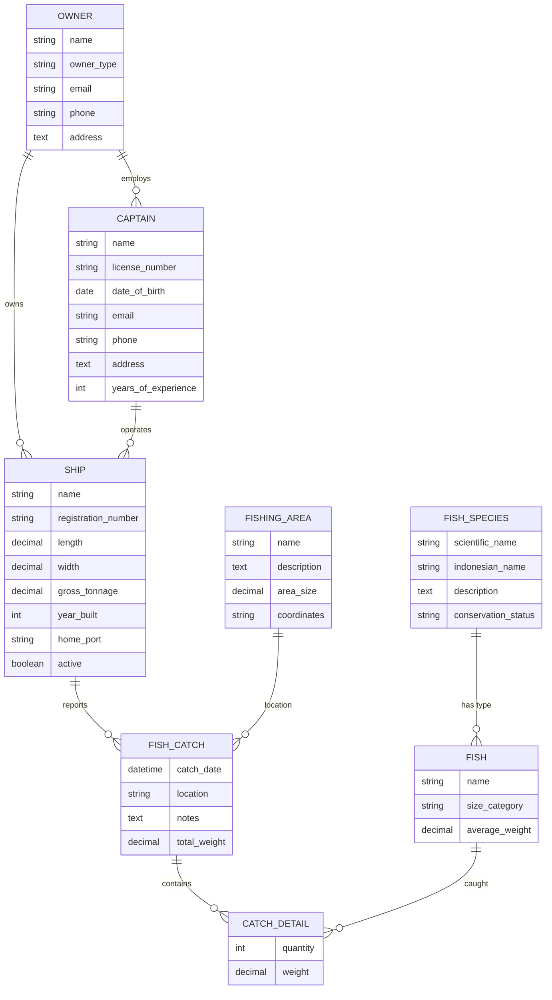

# Diagram Hubungan Model FCO

Berikut adalah diagram yang menunjukkan hubungan antara berbagai model dalam sistem FCO:

## Penjelasan Hubungan

### 1. Owner (Pemilik) ↔ Ship (Kapal)

- **Hubungan**: One-to-Many
- **Deskripsi**: Satu pemilik dapat memiliki banyak kapal, tetapi setiap kapal hanya dimiliki oleh satu pemilik.
- **Field**: `owner` di model Ship

### 2. Owner (Pemilik) ↔ Captain (Nahkoda)

- **Hubungan**: One-to-Many
- **Deskripsi**: Satu pemilik dapat mempekerjakan banyak nahkoda, tetapi setiap nahkoda hanya bekerja untuk satu pemilik.
- **Field**: `owner` di model Captain

### 3. Captain (Nahkoda) ↔ Ship (Kapal)

- **Hubungan**: One-to-Many
- **Deskripsi**: Satu nahkoda dapat mengoperasikan banyak kapal, tetapi setiap kapal hanya dioperasikan oleh satu nahkoda.
- **Field**: `captain` di model Ship

### 4. Ship (Kapal) ↔ FishCatch (Laporan Tangkapan)

- **Hubungan**: One-to-Many
- **Deskripsi**: Satu kapal dapat memiliki banyak laporan tangkapan, tetapi setiap laporan tangkapan terkait dengan satu kapal.
- **Field**: `ship` di model FishCatch

### 5. FishCatch (Laporan Tangkapan) ↔ CatchDetail (Detail Tangkapan)

- **Hubungan**: One-to-Many
- **Deskripsi**: Satu laporan tangkapan dapat memiliki banyak detail tangkapan, tetapi setiap detail tangkapan terkait dengan satu laporan.
- **Field**: `fish_catch` di model CatchDetail

### 6. FishSpecies (Spesies Ikan) ↔ Fish (Ikan)

- **Hubungan**: One-to-Many
- **Deskripsi**: Satu spesies ikan dapat memiliki banyak variasi ikan, tetapi setiap ikan terkait dengan satu spesies.
- **Field**: `species` di model Fish

### 7. Fish (Ikan) ↔ CatchDetail (Detail Tangkapan)

- **Hubungan**: One-to-Many
- **Deskripsi**: Satu jenis ikan dapat dicatat dalam banyak detail tangkapan, tetapi setiap detail tangkapan terkait dengan satu jenis ikan.
- **Field**: `fish` di model CatchDetail

### 8. FishingArea (Area Penangkapan) ↔ FishCatch (Laporan Tangkapan)

- **Hubungan**: One-to-Many
- **Deskripsi**: Satu area penangkapan dapat memiliki banyak laporan tangkapan, tetapi setiap laporan tangkapan terkait dengan satu area.
- **Field**: `fishing_area` di model FishCatch

## Dokumentasi Tambahan

Untuk informasi lebih lanjut tentang dokumentasi API dan integrasi dengan drf-spectacular, lihat:

- [DRF_SPECTACULAR_INTEGRATION.md](DRF_SPECTACULAR_INTEGRATION.md) - Integrasi dokumentasi dengan drf-spectacular
- [API_DOCUMENTATION.md](API_DOCUMENTATION.md) - Dokumentasi API terperinci
- [README.md](README.md) - Gambaran umum proyek
