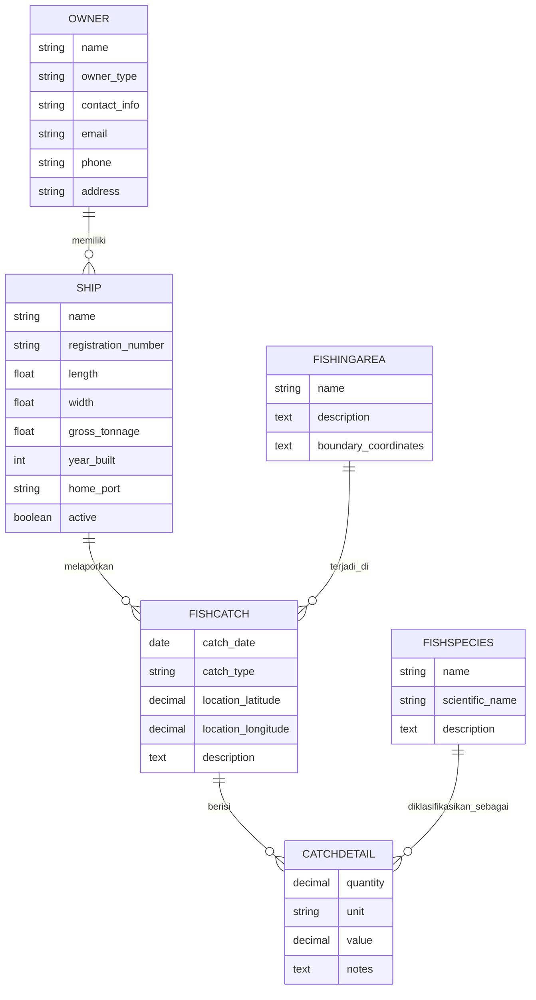

# Hubungan Model FCO

```mermaid
erDiagram
    OWNER ||--o{ SHIP : memiliki
    SHIP ||--o{ FISHCATCH : melaporkan
    FISHCATCH ||--o{ CATCHDETAIL : berisi
    FISHSPECIES ||--o{ CATCHDETAIL : diklasifikasikan_sebagai
    FISHINGAREA ||--o{ FISHCATCH : terjadi_di

    OWNER {
        string name
        string owner_type
        string contact_info
        string email
        string phone
        string address
    }

    SHIP {
        string name
        string registration_number
        float length
        float width
        float gross_tonnage
        int year_built
        string home_port
        boolean active
    }

    FISHSPECIES {
        string name
        string scientific_name
        text description
    }

    FISHCATCH {
        date catch_date
        string catch_type
        decimal location_latitude
        decimal location_longitude
        text description
    }

    CATCHDETAIL {
        decimal quantity
        string unit
        decimal value
        text notes
    }

    FISHINGAREA {
        string name
        text description
        text boundary_coordinates
    }
```
